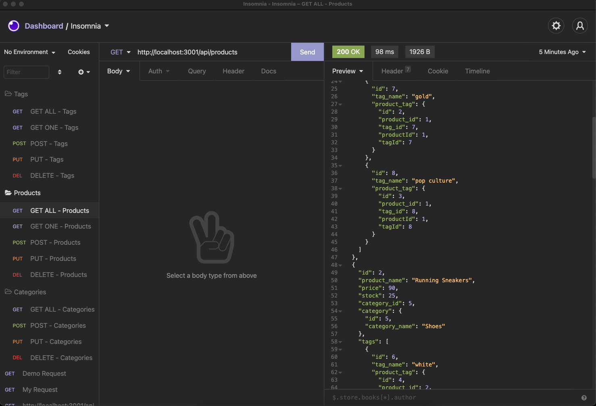

# E-Commerce Back-End API

Video Walkthrough: https://drive.google.com/file/d/1KHvyhf20-k6R3T1q6artTr7hyzj-LLDl/view

REPOSITORY: https://github.com/Hayden-Haun/E-Commerce-Back-End

## Table of Contents

- [Description](#description)
- [Installation](#installation)
- [Contributions](#contributions)
- [Usage](#usage)
- [Tests](#tests)
- [Technologies Used](#Technologies)
- [Credits](#credits)
- [Questions](#questions)

## Description

A functional Express.js API with a database of product information and CRUD routes to get, create, update and delete all data models.

## Installation

    npm i

## Contributions

    Contact the owner

## Usage

    nodemon server.js

## Tests

    none

## Technologies Used

    mySQL, Sequelize, JavaScript, Insomnia, Nodemon, Node Package Managers, Node.JS

## Credits

    Hayden Haun

## Questions

    For additional questions, please contact GitHub user Hayden-Haun at haydenhaun@gmail.com
